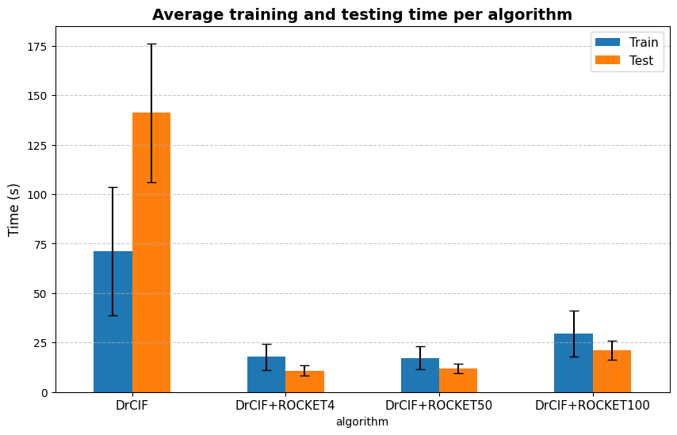
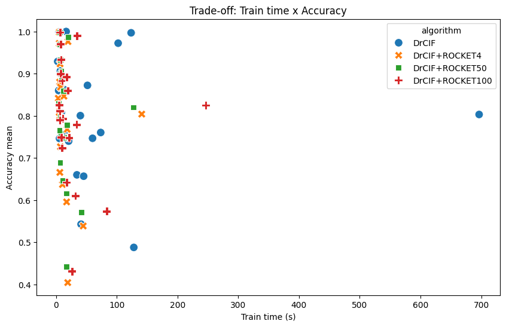
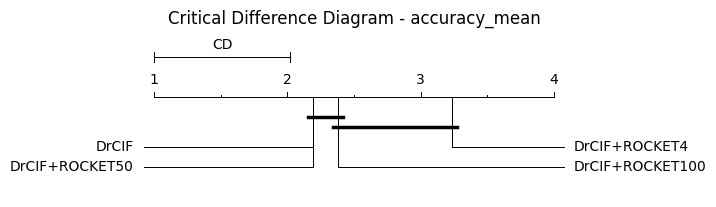

# DrRocket: Integrating DrCIF and ROCKET for Time Series Classification

This repository contains the code, results, and documentation of the Scientific Initiation project developed at the **University of São Paulo (USP)**, under the **Unified Scholarship Program (PUB)**.  
The study investigates a variation of the **DrCIF** classifier, in which the original interval-based features are replaced by **features extracted through the ROCKET algorithm**, aiming to balance accuracy and computational efficiency.

---

## Objectives

This project aims to **investigate new algorithms for time series classification** that achieve computational efficiency **without sacrificing predictive performance**.  
The proposal replaces the traditional statistical features of **DrCIF** with **random convolutional representations** extracted by **ROCKET**, creating a hybrid classifier called **DrRocket**.

This integration seeks to understand the relationship between **computational cost**, **number of kernels**, and **predictive accuracy**, with a focus on real-world applications — especially in the **health domain**, where both efficiency and robustness are crucial.

---

## Methods

Four main configurations were evaluated:

| Model | Description | # Kernels |
|:-------|:------------|:----------:|
| **DrCIF** | Original model using interval-based statistical features | – |
| **DrRocket-4** | Replaces features with 4 random convolutional kernels from ROCKET | 4 |
| **DrRocket-50** | Intermediate version with more diverse convolutional patterns | 50 |
| **DrRocket-100** | Extended version to test performance saturation | 100 |

Experiments were conducted on **21 datasets** from the [UEA & UCR Time Series Classification Archive](https://www.timeseriesclassification.com/), evaluating the following metrics:
- **Accuracy**
- **Precision**
- **Recall**
- **F1-score**
- **Training and testing time**

---
## Repository structure

## 📂 Repository structure

- `DrCIF-ROCKET/`
  - `results/`
    - `plot_time_test_train.png`
    - `scatterplot.png`
    - `cdd_accuracy_mean.png`
  - `DrROCKET.ipynb` — Main implementation and experiments
  - `Optimal_Kernel_Size_Analysis.ipynb` — Kernel number analysis and extended results
  - `README.md` — This file

---

## Results summary

### Execution time
The **original DrCIF** showed the highest computational cost, mainly due to its complex feature extraction process.  
In contrast, the **ROCKET-based variants** drastically reduced training and testing time, especially **DrRocket-4**, which achieved an average runtime below 20 seconds.

  
   
  <em>Figure 1 – Average training and testing time per algorithm.</em>

---

### Trade-off between cost and performance
The figure below illustrates the relationship between training time and average accuracy across the 21 datasets.

- **DrRocket-4** is the fastest but shows significant accuracy losses.  
- **DrRocket-100** increases computational cost with minimal accuracy gains.  
- **DrRocket-50** provides **the best balance** between efficiency and predictive performance.

  
   
  <em>Figure 2 – Trade-off between training time and average accuracy.</em>

---

### 📈 Statistical comparison
The **Critical Difference Diagram** (Figure 3) shows that **DrRocket-50** achieved the best average performance among the hybrid variants, without statistically significant differences from the original DrCIF.

  
   
  <em>Figure 3 – Critical Difference Diagram for average accuracy.</em>

---

## Extended Analysis

The notebook **`Optimal_Kernel_Size_Analysis.ipynb`** contains additional experiments and visualizations, including:
- The effect of **kernel quantity** on model stability  
- **Accuracy comparison by dataset** across different kernel configurations  
- **Ranking heatmaps by dataset** to visualize algorithm performance  
- **Time ranking heatmaps by dataset** to analyze computational efficiency  
- **Critical Difference Diagrams (CDD)** for all metrics, including accuracy, precision, recall, and F1-score  

These analyses help identify the **optimal number of kernels** that minimizes computational cost while maintaining competitive accuracy.

---

## Conclusions

Replacing DrCIF’s interval-based features with ROCKET’s convolutional features proved to be a **viable and efficient alternative**.  
Among all configurations, **DrRocket-50** emerged as the most promising version, achieving accuracy comparable to the original DrCIF while **drastically reducing computational time**.

These findings indicate that combining **interval forests** and **random convolutions** can produce classifiers that are both **scalable and competitive**, maintaining predictive reliability while improving efficiency.

---

## Project Information

**Title:** New Algorithms for Time Series Classification and Extrinsic Regression and Their Application in Health  
**Author:** Isabela Guarnier De Mitri  
**Advisor:** Prof. Diego Furtado Silva  
**Institution:** University of São Paulo (USP)  
**Program:** Unified Scholarship Program (PUB) – 2025  

---

## References

1. Middlehurst, M., Large, J., & Bagnall, A. (2020). *The Canonical Interval Forest (CIF) Classifier for Time Series Classification.* IEEE Big Data.  
2. Dempster, A., Petitjean, F., & Webb, G. I. (2020). *ROCKET: Exceptionally Fast and Accurate Time Series Classification using Random Convolutional Kernels.* DMKD.  
3. Ruiz, A. P. et al. (2020). *The Great Multivariate Time Series Classification Bake Off: A Review and Experimental Evaluation of Recent Algorithmic Advances.* DMKD.  
4. UEA & UCR Time Series Classification Archive (2018). [https://www.timeseriesclassification.com](https://www.timeseriesclassification.com)

---

  © 2025 – Isabela Guarnier De Mitri. University of São Paulo (USP).

